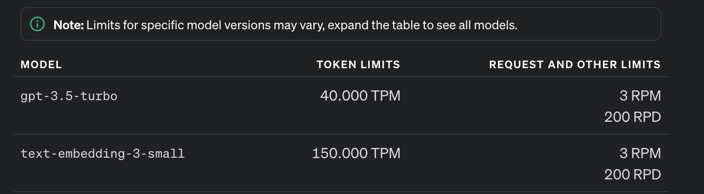
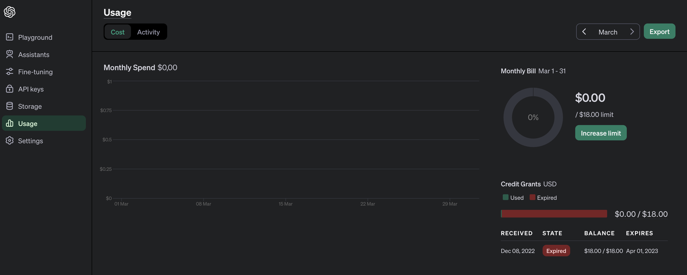

TODO: different account?

# openai-api-trial

## first connection to openai api
https://platform.openai.com/docs/quickstart?context=python

### Rate limits
API usage is subject to rate limits applied on tokens per minute (TPM), requests per minute or day (RPM/RPD), and other model-specific limits. Your organization's rate limits are listed below.

